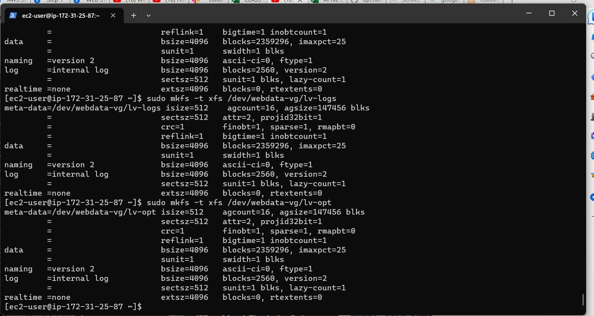
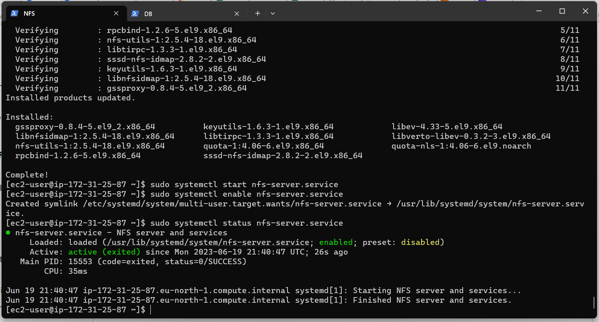
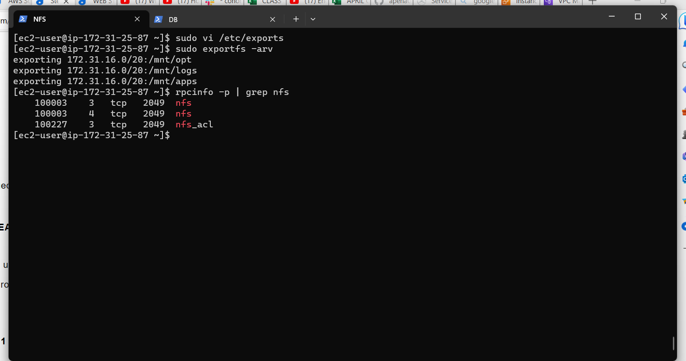
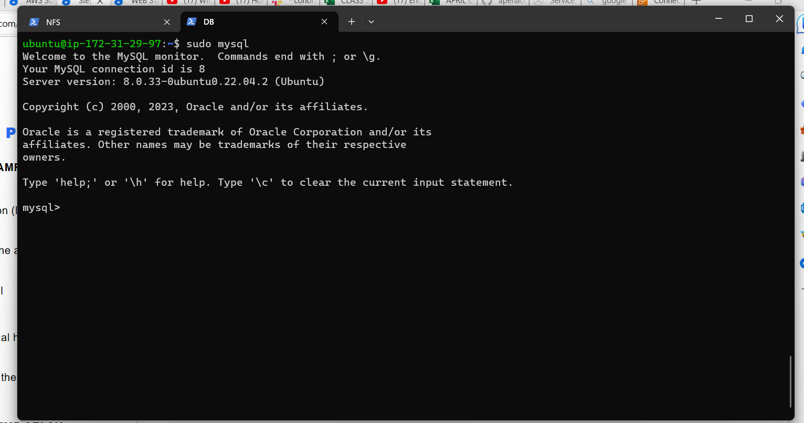
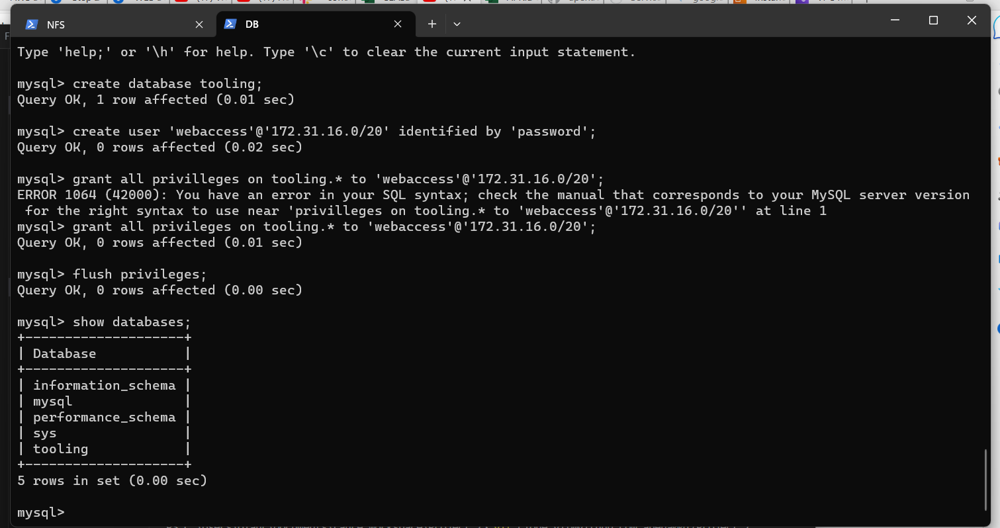
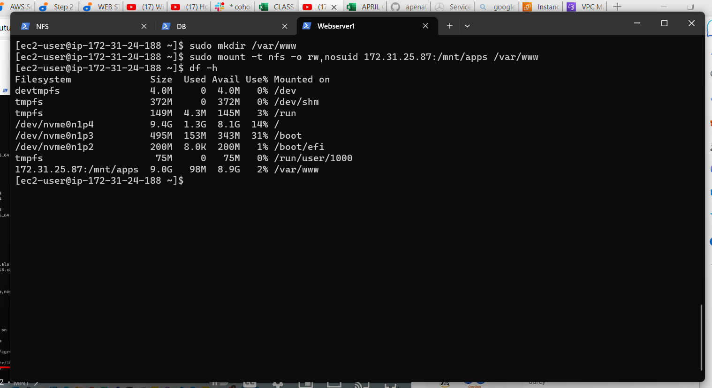
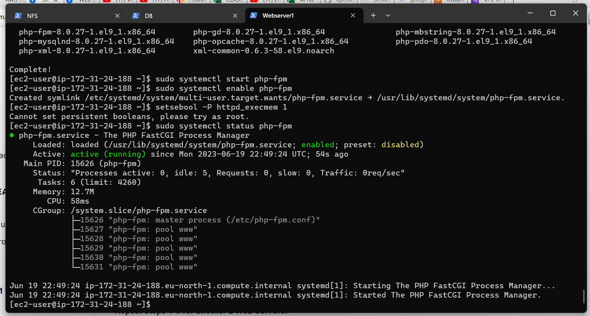
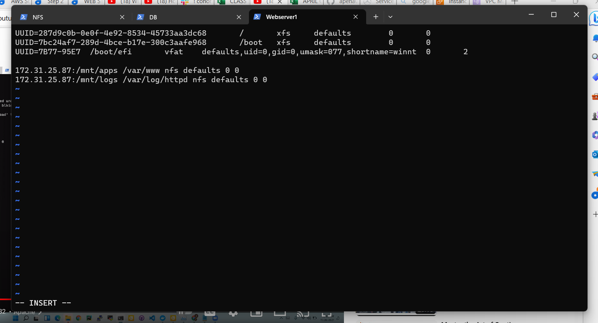
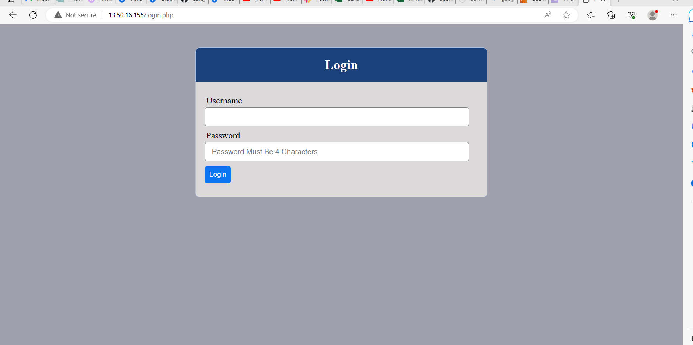
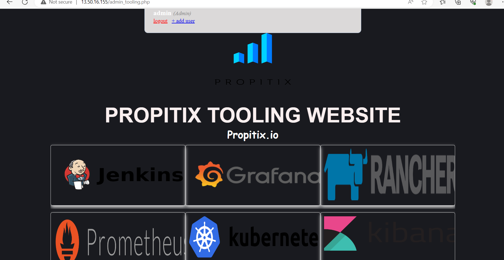

### PROJECT 7: Devops Tooling Website Solution
## STEP 1 – PREPARE NFS SERVER

Spin up a new EC2 instance with RHEL Linux 8 Operating System.
 
 4 RedHart 1 Ubuntu 
 1 for NFS server, 3 server for Webserver and the Ububtu for database server

# based on your LVM experience from Project 6, Configure LVM on the Server.

create 3 volume of 10G and attach to NFS server

## Formating the disks with xfs 

`sudo mkfs -t xfs /dev/webdata-vg/lv-logs`

`sudo mkfs -t xfs /dev/webdata-vg/lv-apps`

`sudo mkfs -t xfs /dev/webdata-vg/lv-opt`

## Creating 3 Logical Volumes. lv-opt lv-apps, and lv-logs

## Create mount points on /mnt directory for the logical volumes as follow:

`sudo mkdir /mnt/apps`

`sudo mkdir /mnt/logs`

`sudo mkdir /mnt/opt`

## Mount lv-apps on /mnt/apps – To be used by webservers
## Mount lv-logss on /mnt/logs – To be used by webservers
## Mount lv-opt on /mnt/opt – To be used for Jenkins

`sudo mount /dev/webdata-vg/lv-apps /mnt/apps`

`sudo mount /dev/webdata-vg/lv-logs /mnt/logs`

`sudo mount /dev/webdata-vg/lv-opt /mnt/opt`

## Install NFS server, configure it to start on reboot and make sure it is u and running

`sudo yum -y update`

`sudo yum install nfs-utils -y`

`sudo systemctl start nfs-server.service`

`sudo systemctl enable nfs-server.service`

`sudo systemctl status nfs-server.service`

## set up permission that will allow our Web servers to read, write and execute files on NFS:

`sudo chown -R nobody: /mnt/apps`
`sudo chown -R nobody: /mnt/logs`
`sudo chown -R nobody: /mnt/opt`

`sudo chmod -R 777 /mnt/apps`
`sudo chmod -R 777 /mnt/logs`
`sudo chmod -R 777 /mnt/opt`

## Reset nfs-server.service

`sudo systemctl restart nfs-server.service`

## Configure access to NFS for clients within the same subnet 

`sudo vi /etc/exports`

## copy and edit the below in the above text editor

/mnt/apps <Subnet-CIDR>(rw,sync,no_all_squash,no_root_squash)
/mnt/logs <Subnet-CIDR>(rw,sync,no_all_squash,no_root_squash)
/mnt/opt <Subnet-CIDR>(rw,sync,no_all_squash,no_root_squash)

`sudo exportfs -arv`

## Check which port is used by NFS and open it using Security Groups (add new Inbound Rule)

`rpcinfo -p | grep nfs`

### Important note: In order for NFS server to be accessible from your client, you must also open following ports: TCP 111, UDP 111, UDP 2049

### STEP 2 — CONFIGURE THE DATABASE SERVER

## Install MySQL server

`sudo apt update`

`sudo apt install mysql-server`

## Create a database and name it tooling

`create database tooling;`

## Create a database user and name it webaccess

`create user 'webaccess'@'172.31.16.0/20' identified by 'password';`

`grant all privileges on tooling.* to 'webaccess'@'172.31.16.0/20';`

`flush privileges;`

`show databaes`

### Step 3 — Prepare the Web Servers

## Launch a new EC2 instance with RHEL 8 Operating System

## Install NFS client

`sudo yum install nfs-utils nfs4-acl-tools -y`

## Mount /var/www/ and target the NFS server’s export for apps

`sudo mkdir /var/www`

`sudo mount -t nfs -o rw,nosuid 172.31.25.87:/mnt/apps /var/www`

## Make sure that the changes will persist on Web Server after reboot:

`sudo vi /etc/fstab`

add following line

172.31.25.87:/mnt/apps /var/www nfs defaults 0 0

## Install Remi’s repository, Apache and PHP

`sudo yum install httpd -y`

`sudo dnf install https://dl.fedoraproject.org/pub/epel/epel-release-latest-8.noarch.rpm`

`sudo dnf install dnf-utils http://rpms.remirepo.net/enterprise/remi-release-8.rpm`

`sudo dnf module reset php`

`sudo dnf module enable php:remi-7.4`

`sudo dnf install php php-opcache php-gd php-curl php-mysqlnd`

`sudo systemctl start php-fpm`

`sudo systemctl enable php-fpm`

`setsebool -P httpd_execmem 1`

## Locate the log folder for Apache on the Web Server and mount it to NFS server’s export for logs

`sudo mount -t nfs -o rw,nosuid 172.31.25.87:/mnt/logs /var/log/httpd`

`sudo vi /etc/fstab`

## Fork the tooling source code from Darey.io Github Account to your Github account. (Learn how to fork a repo here)

## Deploy the tooling website’s code to the Webserver. Ensure that the html folder from the repository is deployed to /var/www/html

## Note 1: Do not forget to open TCP port 80 on the Web Server.

## Note 2: If you encounter 403 Error – check permissions to your /var/www/html folder and also disable SELinux sudo setenforce 0
## To make this change permanent – open following config file sudo vi /etc/sysconfig/selinux and set SELINUX=disabledthen restrt httpd.

## Update the website’s configuration to connect to the database (in /var/www/html/functions.php file). Apply tooling-db.sql script to your database using this command

`mysql -h <databse-private-ip> -u <db-username> -p <db-pasword> < tooling-db.sql`

## Create in MySQL a new admin user with username: myuser and password: password:

## INSERT INTO ‘users’ (‘id’, ‘username’, ‘password’, ’email’, ‘user_type’, ‘status’) VALUES -> (1, ‘myuser’, ‘5f4dcc3b5aa765d61d8327deb882cf99’, ‘user@mail.com’, ‘admin’, ‘1’);

## Open the website in your browser http://<Web-Server-Public-IP-Address-or-Public-DNS-Name>/index.php and make sure you can login into the websute with myuser user.

